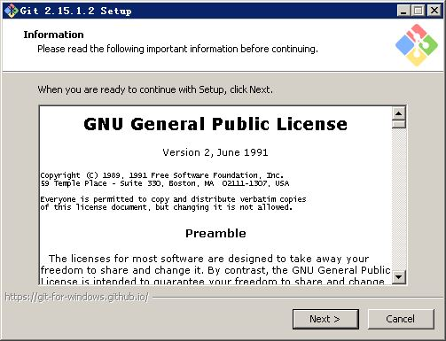
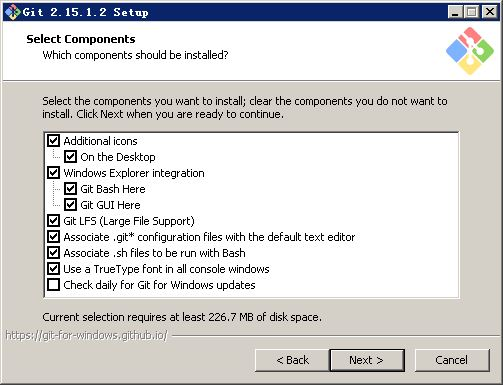
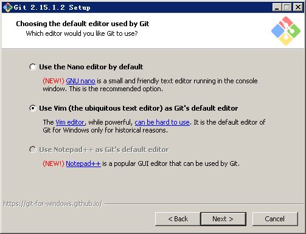
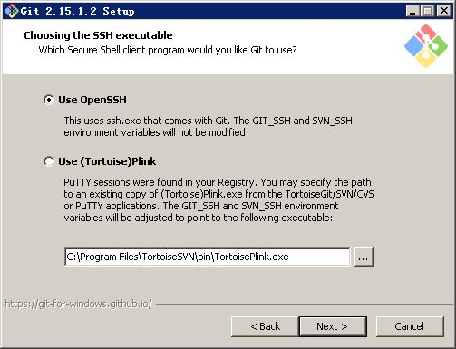
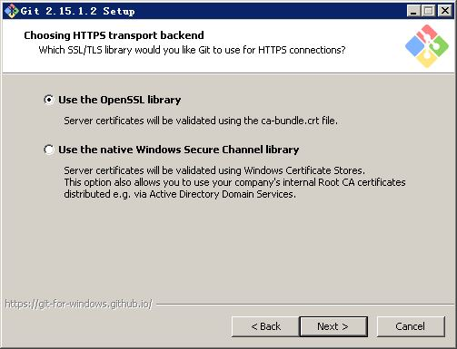
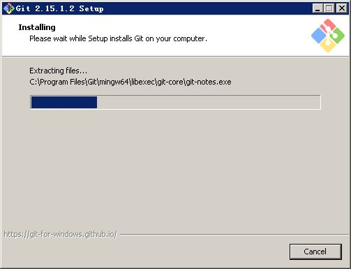

# 安装git

安装git其实很简单，一路Next到底就可以了。

双击已经下载的git安装程序以启动安装。有些操作系统会提示需要管理员权限，选择“是”以继续安装。

证书页，直接Next。

组件选择页，直接Next

默认编辑器选择页，直接Next

PATH参数调整，直接Next

SSH工具选择，直接Next

HTTPS连接设置，直接Next

换行符设置，直接Next

控制台设置，直接Next

附加功能设置，终于点完，点Install

等待安装

安装结束

