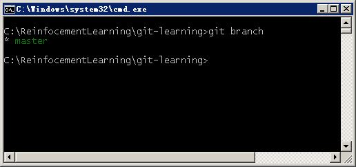
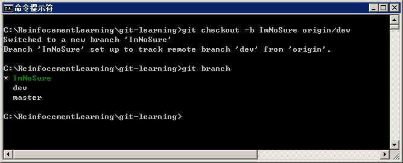
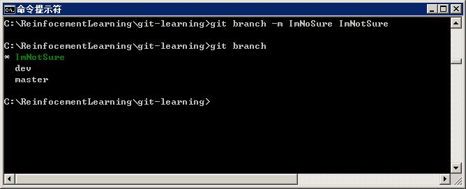
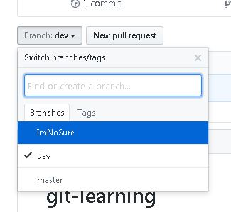

# 文档分支管理

如果我们将保存在Git上同一个仓库里的所有文档看成一个整体，那么当这些文档被不同的人做了不同的修改后，每个人的本地版本互相之间就是不同的。尤其当同一个文件被多个人同时修改，修改的位置又是相同的，而且修改结果又不一样的时候，就会出现修改冲突。git使用分支(Branch)的概念来确保每个人工作在自己的一份拷贝上。对应的，存在一个主分支(master)。项目要求每个人都不能直接工作在主分支上，而是要建立一个自己的分支。
建立属于自己的分支，并在这个分支上进行了必要的修改后，可以将修改提交到主分支。具体的修改和提交流程将会在后面专门的章节进行介绍。

本节介绍最常见的分支管理操作。本项目默认建立两个分支master和dev。master是最终发布到gitbook去的。而dev则是在不断补充内容中的分支。同时每个人还应该建立属于自己的一个分支。

操作前先打开命令行窗口，并进入之前在克隆命令中被创建的仓库文件夹下。例如 C:\ReinfocementLearning\git-learning

## 查看所有分支

可以在本地创建新分支。当本地分支没有被提交到远程服务器(Github)之前，本地和远程的分支数量是不一致的。在操作Git时经常要记得被操作的对象究竟是存在于本地还是远程。

### 查看本地分支

命令：

> git branch

参考结果：

这里只看到一个名为master的分支。代表在本地只有这么一个分支。名字前的星号，代表master是当前激活的工作分支。

### 查看远程分支

命令：

> git branch -r

参考结果：

-r，remote的意思

这里可以看到远程有两个分支：master和dev。
至于HEAD，表示的是当前激活分支指向了master分支。

## 建立及切换分支

为了避免多人同时对一个分支进行编辑修改，本项目对于分支使用有如下要求

* 每个人建立属于自己的分支
* 每个人建立的分支必须以远程dev分支为父级分支
* 每个人的分支名称与各自的Github账号名一致

请按照以下步骤建立个人分支。按照实际情况修改用户名位置的内容

> git checkout -b ImNoSure origin/dev

参考结果：

此命令将建立一个以远程 origin/dev 当前状态为起点的本地分支。

## 删除与充命名本地分支

如果不小心建错了本地分支名，可以使用重命名命令来修改。也可以用删除命令来彻底删除不想要的本地分支

### 修改本地分支名称

> git branch -m ImNoSure ImNotSure

参考结果

### 删除本地分支

待删除的本地分支必须不能是当前活跃分支。因此需要先切换到其他分支，比如master。

> git checkout master  
> git branch -d ImNotSure  

参考结果

## 提交本地分支到远程

前面的所有操作，都是在本地进行。新建的分支在远程并不存在。为了能让自己的工作在远程也能有保存，可以将本地分支推送(Push)到远程服务器上。

这个推送操作其实和日常修改了文档后的推送是一致的。

> git push origin ImNoSure

参考结果：

由于本操作介绍没有做任何实际的文档内容修改，因此提交结果显示很简单。

此时在Github上对应reporsitory里可以看到出现了和本地分支名称一致的新branch。

关于分支的基本操作介绍到此结束。
